## Üdv látogató!

Ez a bemutatkozó oldal azt hivatott elősegíteni, hogy valamennyire rálátásod legyen tudásomra és programozói múltamra, mivel **Junior fejlesztőként jelenleg első munkahelyemet keresem**.

### PROG-BIO

Gyerekkori hobbim volt a programozás, 14 éves korom körül kezdtem autodidakta módon **Pascal** nyelven kódolni DOS alatt még internet nélkül, csak könyvek, és egy ismerős segítségével. Belekóstoltam érdekességképpen az **Assembly** nyelvbe is ekkortájt. Gimnázium után elvégeztem egy 2 éves iskolarendszerű OKJ-s programozói tanfolyamot, itt váltottam **C++** nyelvre, és Windows alatti fejlesztésnél **C++ Builder** fejlesztőkörnyezetre.

Az élet úgy hozta, hogy végül nem a programozói világban helyezkedtem el, de számítógépes munkáim során érintőlegesen foglalkoztam az elmúlt 20 évben is kisebb programok, **javascriptek**, **CSS** és **HTML** fájlok szerkesztésével/írásával.

Az elmúlt évben elhatároztam, hogy pályát váltok, és megpróbálok a programozói szektorban elhelyezkedni, de mivel a tudásom meglehetősen elavultnak számított ennyi idő után, úgy döntöttem, hogy egy bootcamp képzés keretén belül felfrissítem ismereteimet.

Így történt, hogy a közelmúltban elvégeztem a PROGmasters **Junior Java backend fejlesztő** tanfolyamát, ahol megismerkedtem a **Java** nyelvvel, amiben jelenleg programozok. Ugyanitt elkezdtem a **Real Code Academy** programot.

### JELENLEG

Bemutatkozó projektem élő demóval: [https://github.com/vackera/five-in-a-row](https://github.com/vackera/five-in-a-row)

Friss, a képzésen felszedett ismereteim címszavakban:

**• Java • Spring • Hibernate • SQL • JPA • JDBC • Maven • Agilis módszertan • Jira • Docker • Git • Clean code • Unit, Selenium és integrációs tesztelés •**

Egyéb ismeretek:

**• HTML • CSS • Javascript • jQuery •**

Jelenleg ismerkedek:

**• Angular • TypeScript •** (hamarosan a bemutatkozó projekten is látszik)

Természetesen valós munkatapasztalat híján jelenleg juniornak számítok, de mint olvashattad, nem az a tipikus kezdő/pályamódosító vagyok, a programozói véna már gyerekként is megvolt bennem, így jó eséllyel gyorsan fel tudom venni a szükséges tempót.

### KÓD

Mivel a képzésen készített anyagokat nem publikálhatom, csak pár kódrészletet ragadok ki a közel- és távolmúltból, hogy mégis látszódjék némi saját kód is itt.

*mostanában Java...*

```
    public List<String> getPlanetsNeverBoughtAnything() {

        return planetList.stream()
                .filter(p -> spaceshipList.stream().noneMatch(s -> s.getTotalSalePerPlanets().containsKey(p.getId())))
                .map(Planet::getName)
                .collect(Collectors.toList());
    }
```

---

```
    @ResponseStatus(HttpStatus.CREATED)
    @PostMapping
    public void createArticle(@RequestBody @Valid ArticleTitleContentDto articleTitleContentDto,
                              @RequestParam(name = "author_id") int authorId) {

        articleService.createArticle(articleTitleContentDto, authorId);
        log.info("Article created: {} - {}", authorId, articleTitleContentDto.getTitle());
    }
```

---

```
    @Query("select new org.example.dto.ResultDto(r. id, r.datePlayed, r.name, r.winnerStepCount, r.winnerTime) from Result r order by r.winnerStepCount asc, r.winnerTime asc")
    List<ResultDto> getBestResults(Pageable pageable);
```

---

*régen Pascal, Assembly, C++ ... (ezekben Clean Code-t még nem érdemes keresni)*

```
asm	{
    cli
    mov		al,00110110b
    out		43h,al
    mov		ax,10000
    out		40h,al
    mov		al,ah
    out		40h,al
    sti
}
```

---

```
    repeat
        ch:=readkey;
        if ch=#72 then p:=p+1;
        if ch=#80 then p:=p-1;
        if p=0 then p:=100;
        if p=101 then p:=1;
        str(p,esz);
        bar(370,215,496,275);
        outtextxy(380,240,esz);
    until (ch=#13)or(ch=#27);
```

---

```
    kulcsp[0]:= '....................';
    kulcsp[1]:= '......*******.......';
    kulcsp[2]:= '.....*********......';
    kulcsp[3]:= '....***.....***.....';
    kulcsp[4]:= '....***.....***.....';
    kulcsp[5]:= '....***.....***.....';
    kulcsp[6]:= '.....*********......';
    kulcsp[7]:= '......*******.......';
    kulcsp[8]:= '........***.........';
    kulcsp[9]:= '........***.........';
    kulcsp[10]:='........***.........';
    kulcsp[11]:='........***.........';
    kulcsp[12]:='........***.........';
    kulcsp[13]:='........***.........';
    kulcsp[14]:='...********.........';
    kulcsp[15]:='.....******.........';
    kulcsp[16]:='.......****.........';
    kulcsp[17]:='.....******.........';
    kulcsp[18]:='...********.........';
    kulcsp[19]:='....................';
```

---

```
    if (a<13 && b<13) {                     //3-as lehetosegek keresese
        v=u=k=0;
        for (c=0;c<3;c++) {
            if (tabla[a+c][b+c]=='x') v++;
            else if (tabla[a+c][b+c]==' ') u++;
            else k++;
        }
        if (v==2 && u==1) {
            for (c=0;tabla[a+c][b+c]!=' ';c++) ;
            if (a-1<0 || b-1<0 || a+3>14 || b+3>14
                    || tabla[a-1][b-1]=='o' || tabla[a+3][b+3]=='o')
                vfok[a+c][b+c]+=_3as/arany;
            else
                vfok[a+c][b+c]+=_3as;
        }
        if (k==2 && u==1) {
            for (c=0;tabla[a+c][b+c]!=' ';c++) ;
            if (a-1<0 || b-1<0 || a+3>14 || b+3>14
                    || tabla[a-1][b-1]=='x' || tabla[a+3][b+3]=='x')
                efok[a+c][b+c]+=e_3as/earany;
            else
                efok[a+c][b+c]+=e_3as;
        }
    }
```

### KÉPERNYŐKÉP

*(régi programok screenshotjai)*

<p align="center">
  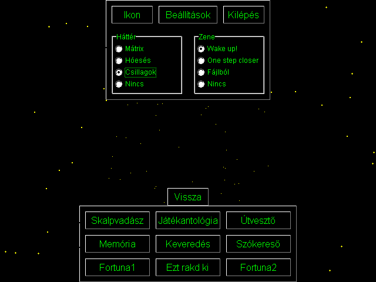
  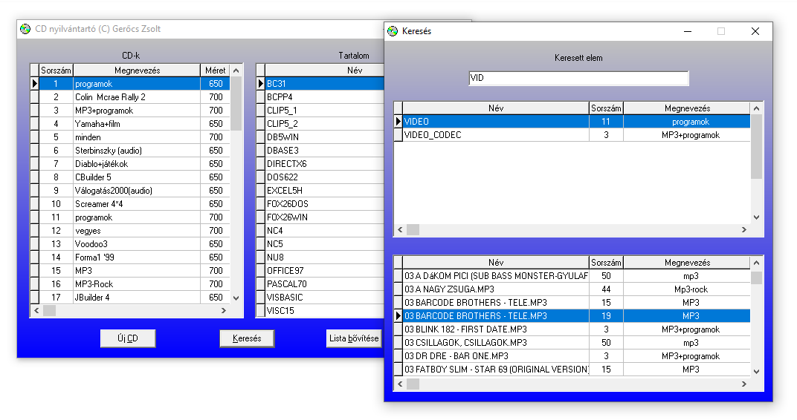
  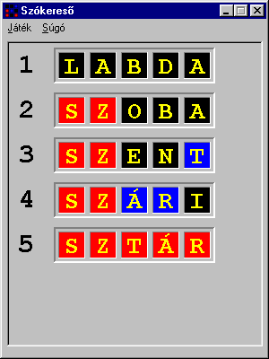
  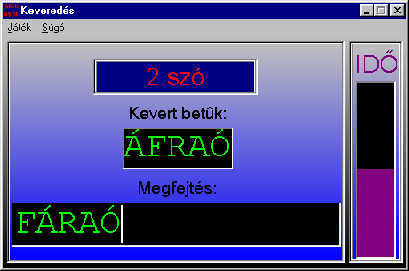

</p>
<p align="center">
  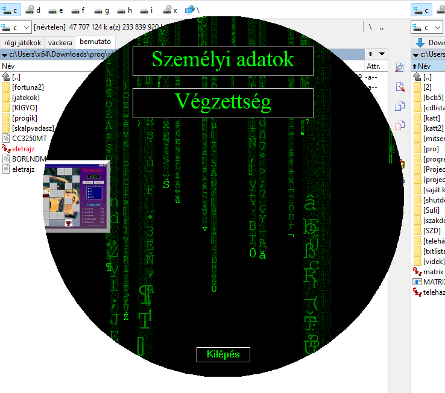
  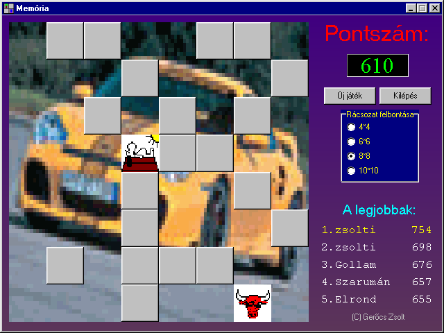
  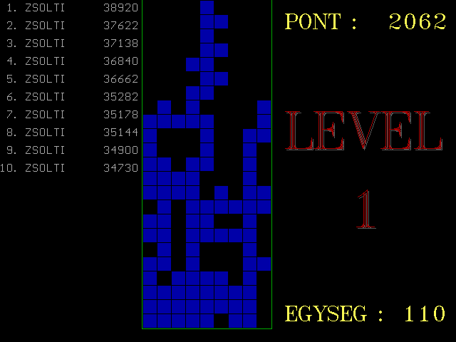
  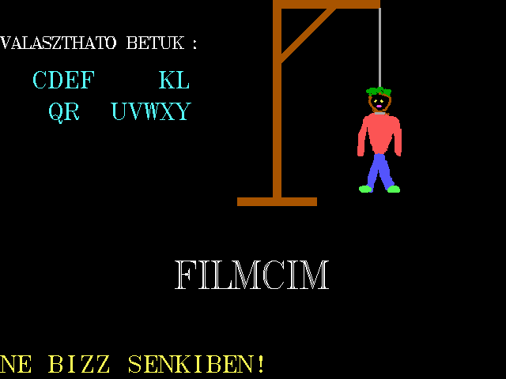
</p>
<p align="center">
  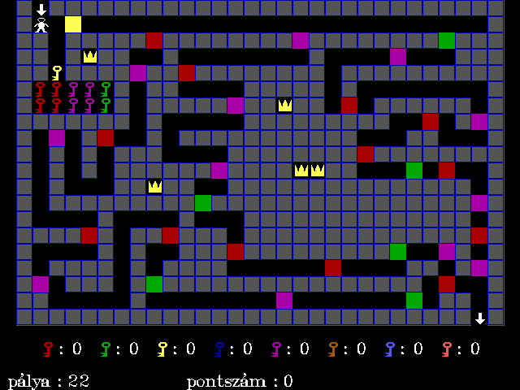
  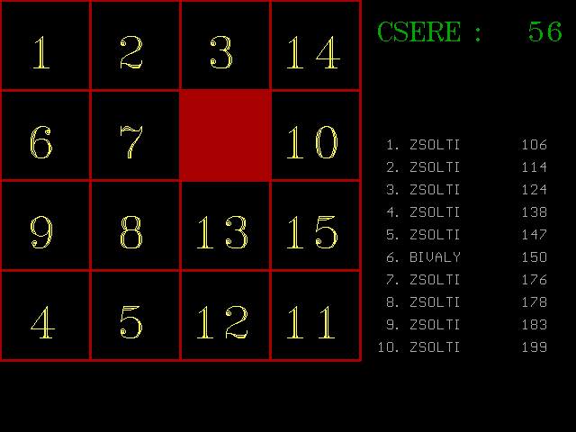
  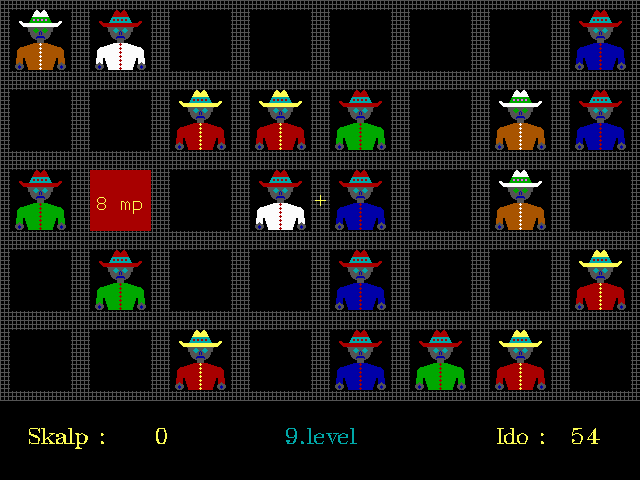
  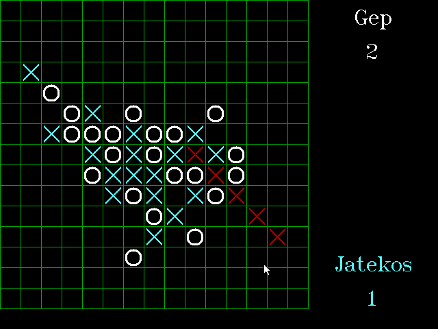
</p>
<p align="center">
  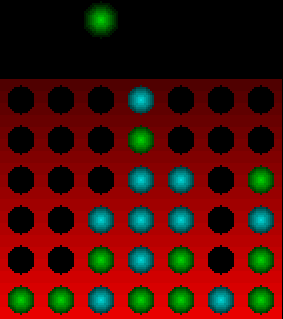
  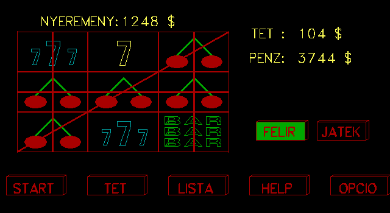
  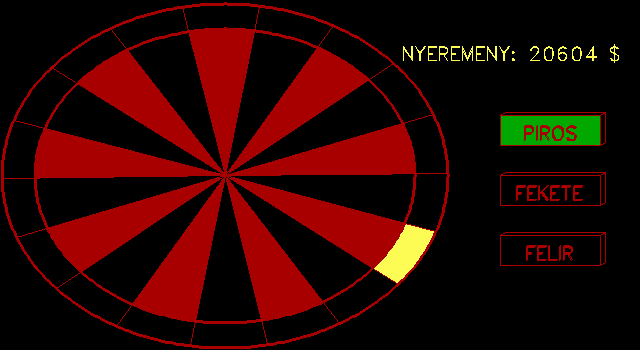
  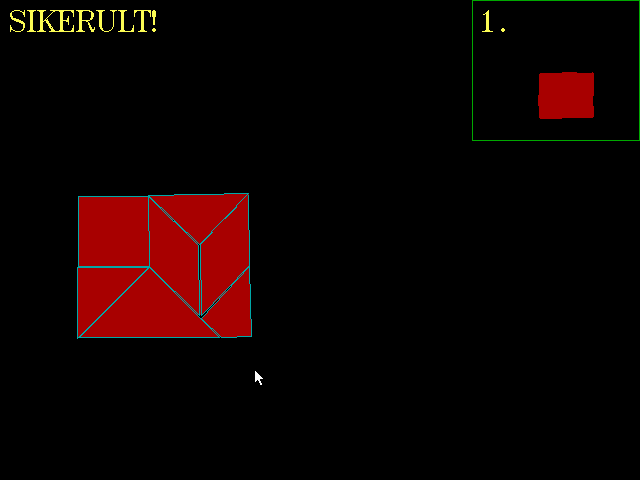
</p>
